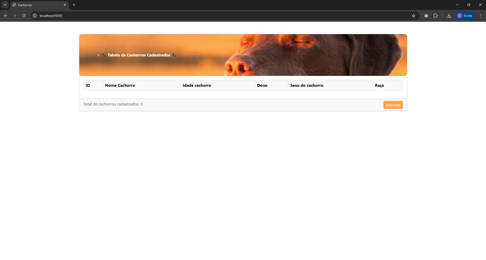
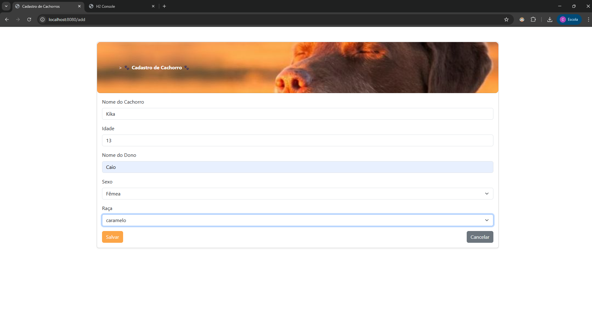
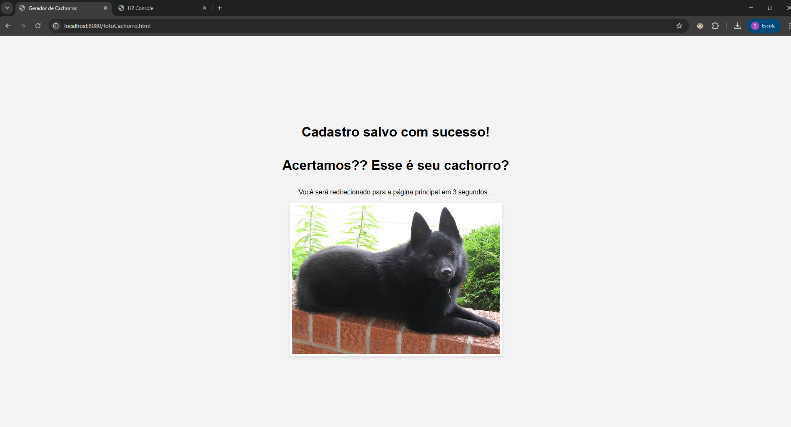
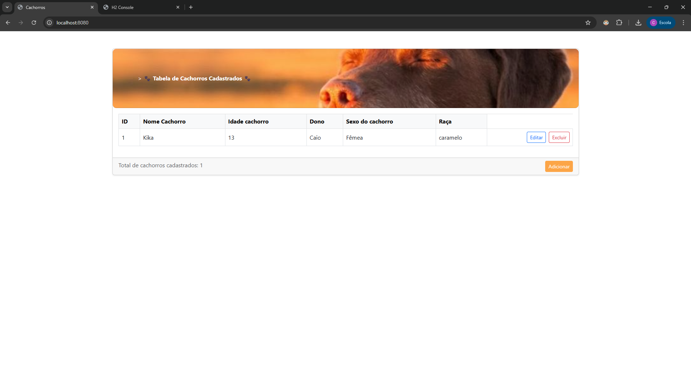

# 🐾 Sistema de Gerenciamento de Cachorros

Um **CRUD completo** desenvolvido para **cadastro, visualização, edição e exclusão** de informações sobre cachorros, utilizando **Spring Boot**, **Thymeleaf** e integração com a **DOG API** 🐶.

---

## 👥 Autores

- **Caio Augusto Poleto Gonçalves – 04723-063**  
- **Felipe Inácio de Barros Sousa – 04723-044**  
- **Paulo Henrique Sant’Anna Marques – 04723-069**

---

## 📝 Descrição do Projeto

O **Sistema de Gerenciamento de Cachorros** é uma aplicação web desenvolvida em **Java Spring Boot** para cadastrar, listar, editar e excluir informações sobre cachorros.  
Além disso, o sistema consome uma **API externa (DOG API)** para exibir fotos aleatórias de cães após o cadastro.

O projeto segue o padrão **MVC (Model–View–Controller)** com camadas bem definidas:  
Model → Repository → Service → Controller → View (Thymeleaf).

---

## ⚙️ Passos para Executar a Aplicação

### 🔧 Pré-requisitos

- **Java 17+**
- **Maven**
- **IDE** (Spring Tool Suite, IntelliJ ou VS Code com extensões Java)
- **Banco de dados H2** (configurado no `application.properties`)

### ▶️ Execução

Acesse o sistema em:  
👉 **http://localhost:8080**

---

## 🖼️ Prints das Telas Principais

### 🏠 Tela Inicial – Lista de Cachorros
Exibe todos os cachorros cadastrados, com botões para editar e excluir.

---

### 🐶 Tela de Cadastro de Cachorro
Formulário para inserir nome, idade, dono, sexo e raça.

---

### ✅ Tela de Confirmação de Cadastro
Mostra uma mensagem de sucesso e uma foto aleatória da **DOG API**.

---

### 📋 Tela de Lista com Registro Cadastrado
Lista atualizada mostrando o cachorro recém cadastrado.

---

## 🧱 Estrutura das Camadas

| Camada | Função |
|--------|--------|
| **Model** | Representa as entidades e relacionamentos |
| **Repository** | Acesso ao banco de dados via Spring Data JPA |
| **Service** | Contém a lógica de negócio |
| **Controller** | Gerencia as rotas e requisições do usuário |
| **View (Thymeleaf)** | Renderiza as páginas HTML dinâmicas |

---

## 📚 Tecnologias Utilizadas

- **Java 17**
- **Spring Boot**
- **Spring Data JPA**
- **Thymeleaf**
- **Maven**
- **DOG API** (https://dog.ceo)
- **HTML / CSS / JavaScript**

